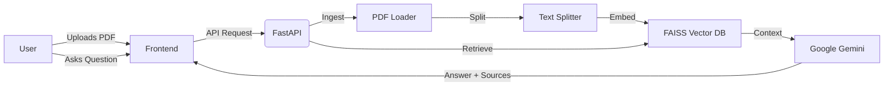
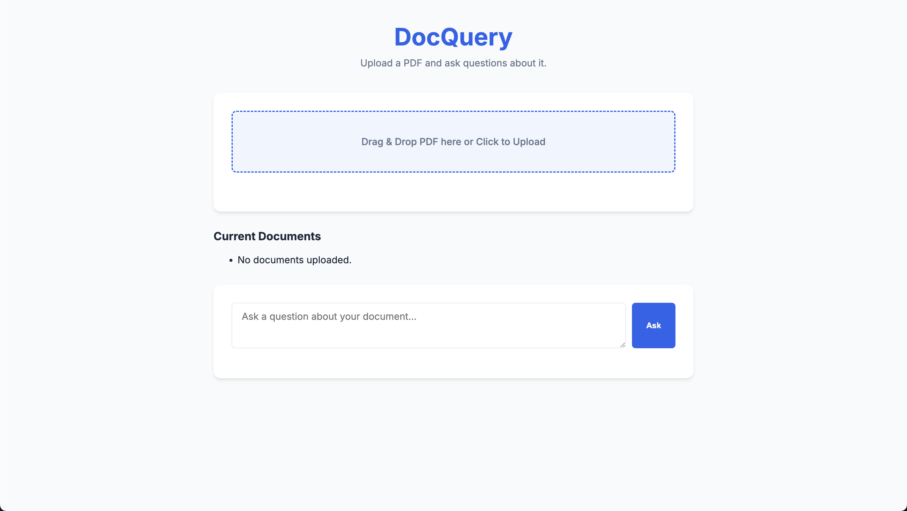
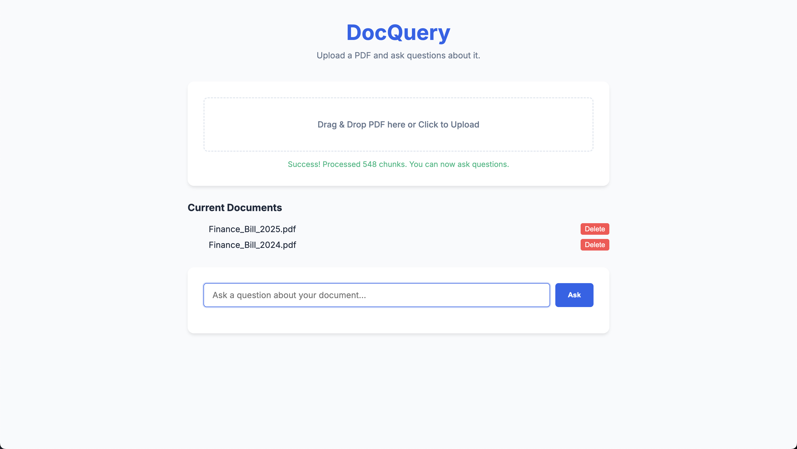
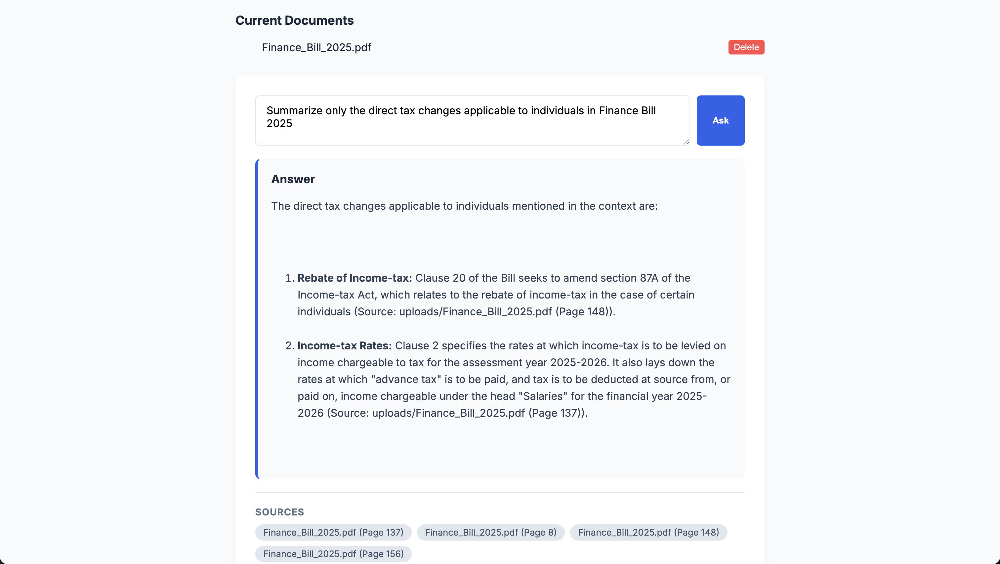

# 📄 DocQuery - Intelligent AI PDF Assistant


> **Interact with your documents smarter, faster, and deeper.**  
> DocQuery is a powerful **Retrieval-Augmented Generation (RAG)** system built to bridge the gap between static PDF documents and dynamic intelligence. Upload your files, ask complex questions, and get precise, citation-backed answers instantly.

---

## 🚀 Features at a Glance

| Feature | Description |
| :--- | :--- |
| **🧠 Advanced RAG Pipeline** | Intelligent document chunking and retrieval using FAISS vector search. |
| **🤖 Gemini Powered** | Utilizes Google's cutting-edge **Gemini Flash** model for reasoning and generation. |
| **📍 Precision Citations** | Every answer comes with exact source verification (File & Page Number). |
| **📂 Document Management** | Easily View, Upload, and Delete documents directly from the UI. |
| **🎨 Modern UI** | A clean, responsive, and beautiful interface built with Vanilla JS & CSS. |
| **🧹 Auto-Cleanup** | Smart server lifespan management ensures data privacy by wiping storage on shutdown. |

---

## 🏗️ Architecture



## 🛠️ Tech Stack

-   **Backend:** Python 3, FastAPI, Uvicorn
-   **AI Core:** LangChain, Google Generative AI (Gemini), FAISS-CPU
-   **Frontend:** HTML5, CSS3, JavaScript (ES6+)

---

## 📥 Installation

Clone the repository and navigate to the project root:

```bash
git clone https://github.com/Shamprakash1609/Chat-with-pdf.git
cd Chat-with-pdf
```

### 1️⃣ Backend Setup
Create a virtual environment and install the required dependencies:

**macOS / Linux:**
```bash
python3 -m venv venv
source venv/bin/activate
pip install -r backend/requirements.txt
```

**Windows:**
```powershell
python -m venv venv
venv\Scripts\activate
pip install -r backend/requirements.txt
```

### 2️⃣ Environment Config (API Key)
The application requires a Google Gemini API Key to function correctly.

1. Get your API key from [Google AI Studio](https://aistudio.google.com/).
2. Copy the example environment file:
```bash
cp backend/.env.example backend/.env
```
3. Open `backend/.env` and paste your API key:
```env
GOOGLE_API_KEY="your-api-key-here"
```

---

## ⚡ Quick Start

You need to run **both** the backend API and the frontend UI.

### 1. Start the Backend API
```bash
# In the project root with your venv activated:
./run.sh
```
*The backend server will start at `http://127.0.0.1:8000`*

### 2. Start the Frontend UI
Open a **new terminal tab**, navigate to the project directory, and start a simple web server:
```bash
cd Chat-with-pdf
python3 -m http.server 8001 --directory frontend
```
*Access the application interface at `http://localhost:8001`*

---

## 🖥️ Usage Demo

### 1. 📤 Upload Interface
*Drag & Drop simplicity for your files.*


### 2. ✅ Processing & Management
*Real-time status updates and document list.*


### 3. 💬 Intelligent Q&A
*Get answers with confidence and verified sources.*


---

## 🔮 Future Roadmap

- [ ] 🗣️ **Conversational Memory**: Follow-up questions and context retention.
- [ ] 📄 **Multi-Format Support**: DOCX, TXT, and Markdown support.
- [ ] ☁️ **Cloud Storage**: Integration with AWS S3 / Azure Blob.
- [ ] ⚡ **Socket.io**: Real-time streaming responses.

---

<p align="center">
  Made with ❤️ by <a href="https://github.com/Shamprakash1609">Shamprakash</a>
</p>
